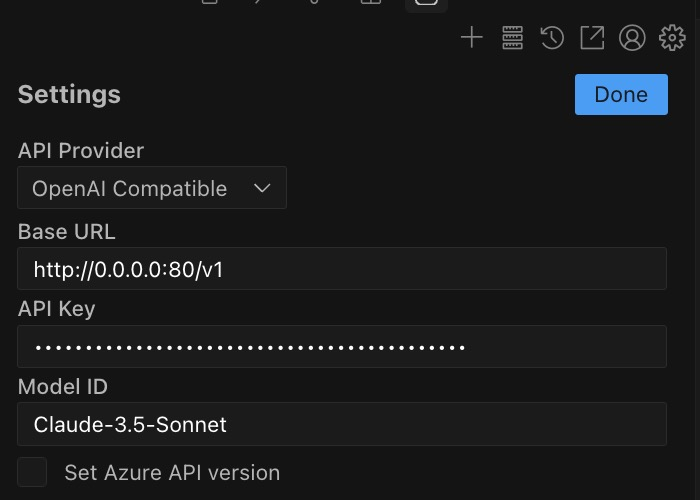
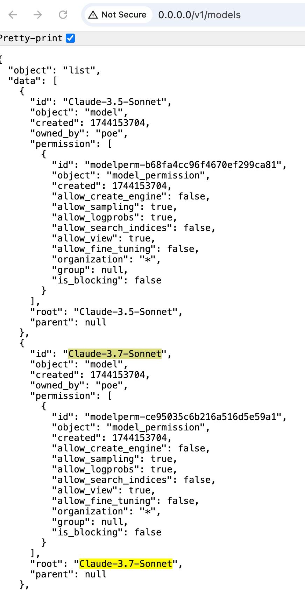
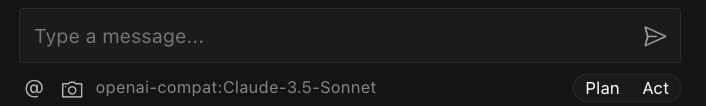
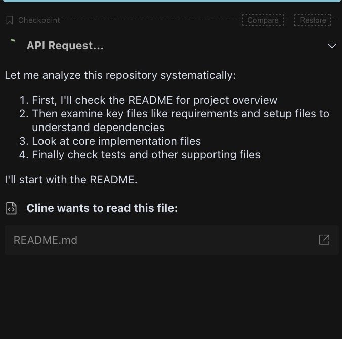
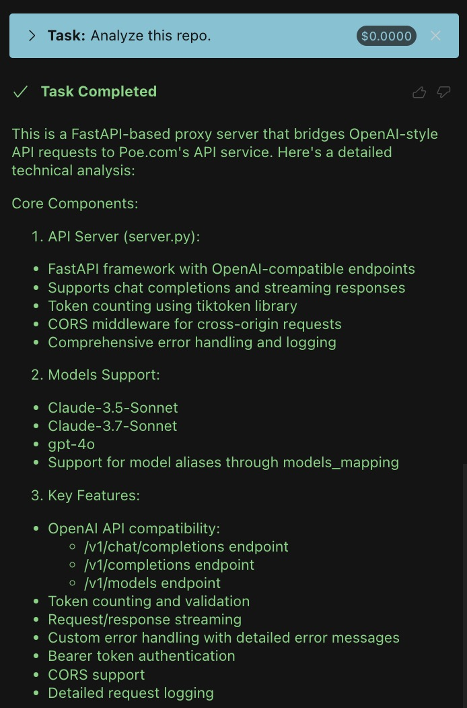
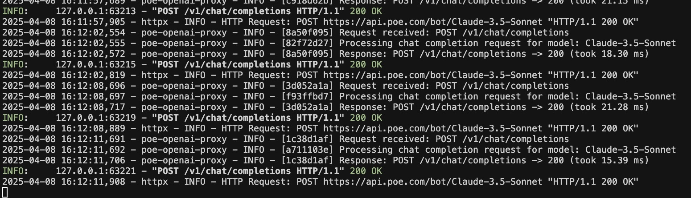

# Poe API Bridge

OpenAI API compatible server that proxies requests to Poe.com.

## Server
Populate these environment variables in `.env`:
> **Important:** Do not check these in.

```
SERVER_PORT=80
POE_API_KEY=1234567890-234567890  # Copy from poe.com/api_key
# Optional: Override the base URL for Poe BotQuery API
# e.g., BOT_QUERY_API_BASE_URL=https://chunho-testing.quora.net/bot/
BOT_QUERY_API_BASE_URL=https://api.poe.com/bot/
```

Start in dev mode (with auto-reload)
```
make start-dev
```

Start in production mode
```
make start
```

## Testing
Run automated tests
```
make test
```

Run verification scripts
```
python3 verify_regular_query.py
```

## Deployment
Deploy to Modal
```
make deploy
```

## Utils
Clean artifacts
```
make clean
```


## E2E testing

### Test with Cursor with local server

1. Install Cursor.

2. Install the `Cline` extension (cline.bot, with 1.2M downloads as of 2025/4/8)

3. Run `make start-dev`.

4. Open `Cline` extension, configure the base URL as `http://0.0.0.0:80/v1/`. Specify the model name as `Claude-3.5-Sonnet`.

  

  * [Optional] You can pick other models listed in `http://0.0.0.0:80/v1/models`.

    

5. You should be good to go!
  * Start with sending a message:
    

  * When the task is in progress
    
  * When it completes:
    

6. In your tab, you should see some HTTP requests sent to the local server:

  
